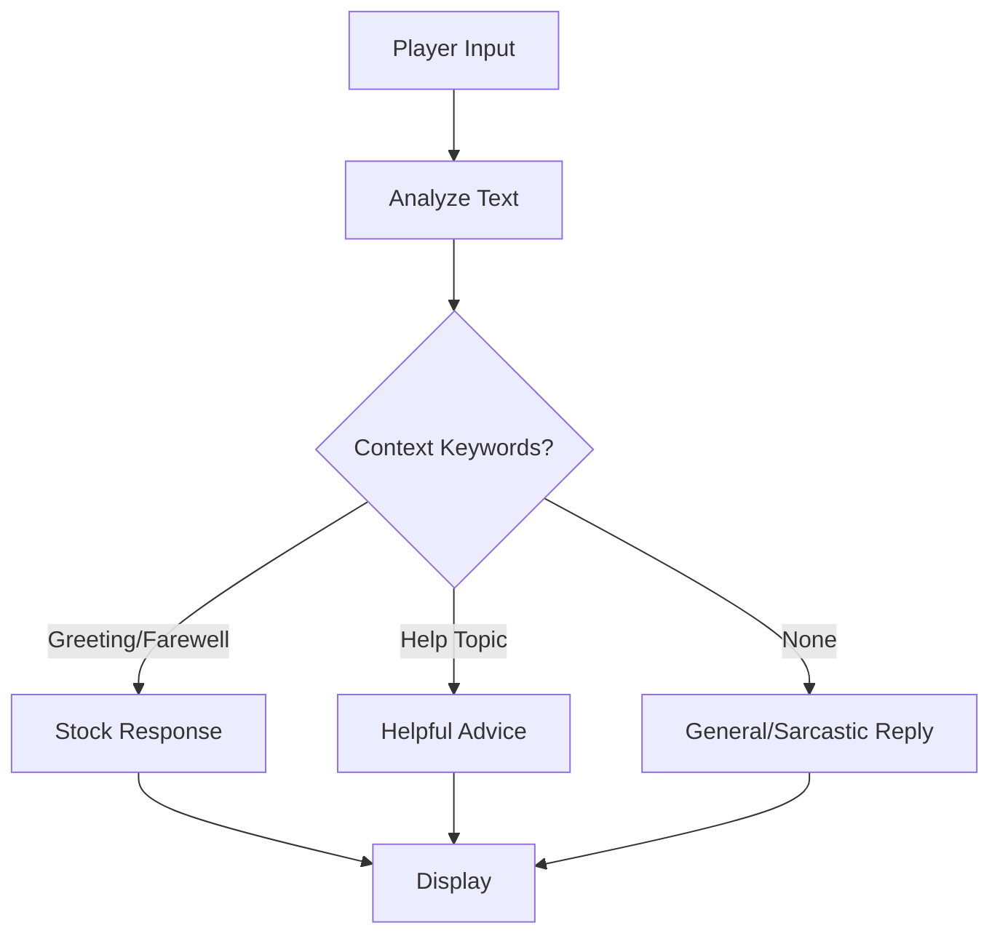

# AI Counselor

## Purpose
A cheeky onboard AI that offers sarcastic yet helpful advice through a chat interface, enriching player interactions and providing hints.

## Key Classes
- `CounselorResponse` – dataclass holding the generated message, mood and optional context.
- `ShipCounselor` – main chatbot class; parses player input, selects responses and displays them with the `rich` console library.

## Integration Points
- Can be invoked from any game screen to provide feedback based on current player context (credits, health, fuel, etc.).
- Conversations and advice can be recorded as part of the player's game state for persistence via the `SaveGameSystem`.

## Example Usage
```python
from game.ai_counselor import ShipCounselor

counselor = ShipCounselor()
response = counselor.chat("I need help with trading", player_context={"credits": 50})
counselor.display_response(response)
```

## Chat Flow


