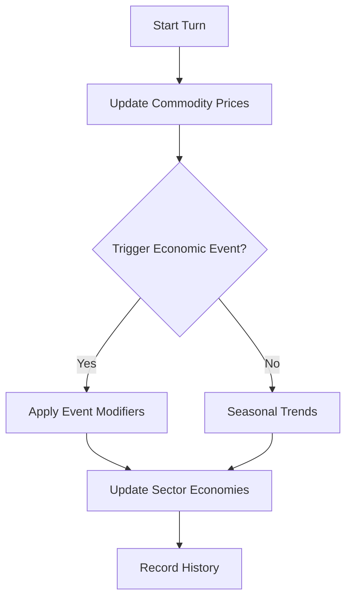

# Dynamic Market System

## Purpose
Provides a living economy where commodity prices shift with supply and demand, seasonal trends and random galactic events.  Each sector maintains its own economy so trading routes feel reactive and dynamic.

## Key Classes
- `MarketCondition` – overall health of a sector's economy.
- `EconomicEvent` – large scale events such as wars or shortages that modify prices.
- `CommodityCategory` – grouping for goods (food, minerals, technology, etc.).
- `MarketData` – per‑commodity information including price, supply and volatility.
- `SectorEconomy` – economic profile for a sector including imports/exports and trade routes.
- `DynamicMarketSystem` – orchestrates price updates, economic events and trade execution.

## Integration Points
- Used by the `TradingSystem` to price goods and determine profitable routes.
- Sector data from the world/sector generator feeds into `initialize_sector_economy`.
- Market state can be persisted through the `SaveGameSystem` by storing `trading_data`.

## Example Usage
```python
from game.dynamic_markets import DynamicMarketSystem

market = DynamicMarketSystem()
market.initialize_sector_economy(
    sector_id=1,
    wealth_level=1.0,
    population=500_000,
    industrial_capacity=1.2,
    trade_routes=[2, 3]
)

# advance the simulation
market.update_market(turn_number=1)
prices = market.get_sector_prices(1)
print(prices.get("Gold"))

# execute a trade
trade = market.execute_trade("Gold", quantity=10, sector_id=1, is_buy=True)
print(trade)
```

## Flow


