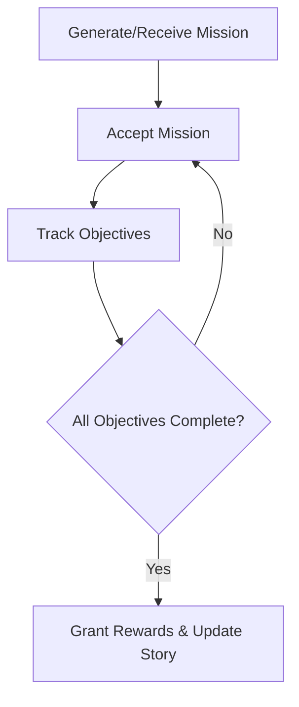

# Mission Generator

## Purpose
Creates both procedural and story driven missions with dynamic objectives, difficulty scaling and branching chains.  It keeps the game world populated with tasks appropriate to the player's progress.

## Key Classes
- `MissionType`, `MissionDifficulty`, `MissionStatus`, `ObjectiveType` – enums that define mission properties.
- `MissionObjective` – single task within a mission (kill, collect, deliver, etc.).
- `MissionReward` – credits, items and reputation awarded on completion.
- `Mission` – complete mission definition with objectives and rewards.
- `MissionChain` – ordered or branching sequences of missions forming a storyline.
- `MissionGenerator` – builds procedural missions from templates and player context.
- `StoryMissionManager` – manages predefined story chains.
- `MissionManager` – top‑level system tracking active/available missions and updating progress each turn.

## Integration Points
- The mission manager can query player level, location and reputation from `Player` and world modules.
- Completed missions award rewards and can influence the trading or dynamic market systems.
- Mission state is stored via `SaveGameSystem` inside the `mission_data` portion of `GameState`.

## Example Usage
```python
from game.enhanced_missions import MissionManager

missions = MissionManager()
missions.update_turn()               # generate initial missions
available = missions.get_available_missions(player_level=5,
                                            player_location=1,
                                            player_progress={})
chosen = available[0]
missions.accept_mission(chosen.id)

# progress an objective
missions.update_mission_progress(chosen.id, chosen.objectives[0].id, amount=1)
```

## Mission Flow


