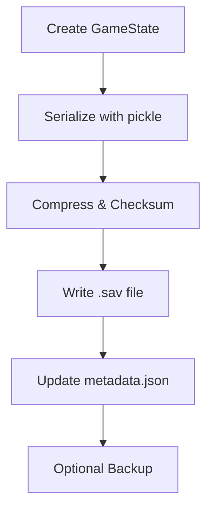

# Save System

## Purpose
Handles persistent game progress with compression, checksums, auto‑saving and backup management.  Game sessions can be restored exactly as they were left.

## Key Classes
- `SaveMetadata` – summary information for each save slot.
- `GameState` – serialisable snapshot of player, world and mission data.
- `SaveGameSystem` – core manager providing `save_game`, `load_game`, `auto_save`, backups and integrity checks.

## Integration Points
- `SaveGameSystem.create_game_state` gathers data from player, world, missions, NPCs and trading systems.
- Auto‑save can be triggered from the main loop or combat/travel subsystems.
- Market and mission modules persist their state by storing into the `trading_data` and `mission_data` fields of `GameState`.

## Example Usage
```python
from game.save_system import SaveGameSystem, GameState

save_system = SaveGameSystem()

state = GameState(
    player_data={"name": "Nova", "level": 3, "credits": 1200},
    world_data={"current_sector": 1},
    mission_data={}, npc_data={}, trading_data={},
    skill_data={}, combat_data={}, settings={}, statistics={},
    achievements=[], timestamp=0.0
)

save_id = save_system.save_game(state, description="Before battle")
loaded_state = save_system.load_game(save_id)
```

## Save Flow


